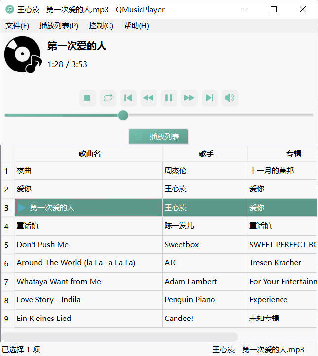

# QMusicPlayer

----

## 概述

一个基于 Qt6 开发的简易本地音乐播放器

A Simple Local Music Player Based on Qt6 Development




## 项目说明

本项目基于 GNU General Public License v3.0，仅供学习参考，**请勿用于商业途径！**

具体相关内容，请见 [LICENSE](./LICENSE.txt) 文件。

## 下载安装

1. 前往 [Github Release](https://github.com/CatIsNotFound/QMusicPlayer/releases/latest) 查看最新版本即可。
2. 或者直接克隆项目并编译，具体如何编译请看下文。

## 编译文件说明

在 CMakelists.txt 文件中记得修改以下标注内容：

```
# Attention: Dont forget to modify the CMAKE_PREFIX_PATH variable!
# 请注意修改这里的路径！！
# set(CMAKE_PREFIX_PATH "/path/to/Qt") 
# list(APPEND CMAKE_PREFIX_PATH "./3rdParty/taglib-2.0.2-MSVC")  # 若为 MSVC 微软编译器，取消注释
# list(APPEND CMAKE_PREFIX_PATH "./3rdParty/taglib-2.0.2-MinGW")  # 若为 MinGW 编译器，取消注释
...
```

> NOTES: 
> 
> 1. 关于 `Taglib` 项目，这里使用的是 MSVC 或 MinGW 环境进行编译，若你使用的并非 Windows 系统，请使用自带包管理器或自行编译安装！
> 
> 2. 如果你是使用 Qt Creator， 记得不要忘记注释掉倒数第二行，因为安装的 Qt 目录有所不同，容易出现找不到包的情况！
>

## 如何手动编译项目？

这里只介绍如何在终端下手动编译项目，当然如果你有 IDE（比如：Visual Studio、Jetbrain CLion（最好选择 Visual Studio 编译）、Qt Creator（MSVC）等），请跳过此步，直接在 IDE 编译运行即可。

1. 首先，克隆这个项目，并按照[编译文件说明](#编译文件说明)一节里修改编译文件。

2. 若你已修改完编译文件，请在本项目路径下打开终端：

```shell
mkdir build
cd build
cmake .. -DCMAKE_BUILD_TYPE=Release
```

3. 运行下方编译项目

```shell
cmake --build .. --config Release 
```

4. 在这个目录下找到 `QMusicPlayer` 可执行文件就可以了！（Windows 下是 `QMusicPlayer.exe`）**但是，前提还需要 Qt6 必要的库才能运行！**
   如果在当前目录下找不到，可能在存放在 `.\Release` 目录下。

5. 若在 Windows 环境下，请记得使用 `windeployqt.exe` (位于 Qt 安装目录下) 来复制此程序所需的文件！

> 关于 Taglib 需要注意：
> 
> Windows 环境下需要复制 `tag.dll`（MSVC）或 `libtag.dll`（MinGW）文件到程序同级目录。
> 
> - MSVC 下位于：`\path\to\QMusicPlayer\3rdParty\taglib-2.0.2-MSVC\bin`
> - MinGW 下位于：`\path\to\QMusicPlayer\3rdParty\taglib-2.0.2-MinGW\bin`
> 
